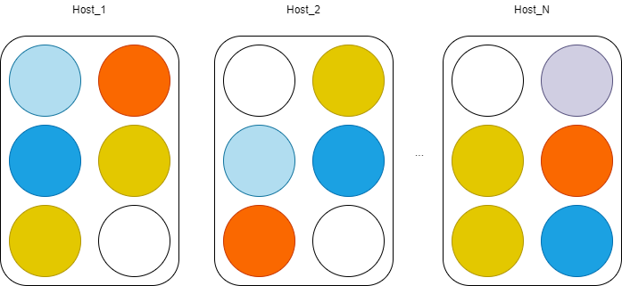

# Koala

## 特点

Koala是一个`VirtualActor`模式的框架, `VirtualActor`模式可以帮你解决`横向扩展`和`高并发`的问题, 但不是银弹, 也有缺点.

* 分散请求
  
  例如MMORPG这种类型的服务器, 会出现很多个玩家集中在一个场景上交互, 这时候就不太适用VirtualActor模式, 而是应该适用传统的Actor模式

  如果对象之间的交互没有那么频繁, 那么是可以使用VirtualActor模式的
  

* 低频的请求
  
  消息在Actor内是串行执行的, 考虑到存档啥的, 所以一个Actor一秒的吞吐量有上限, 不适合高频率的场景.

* 分布式面向对象的交互
  
  VirtualActor模式是分布式面向对象的编程, 所以天然支持对象与对象的交互, 提供了良好的编程体验.

* 集中开发和分开部署
  
  开发模式下, Host可以只有一个进程, 把所有`Service`都放在一个进程内.

  部署的时候, 可以选择将(通过配置)不同的服务放到不同的进程里面.

  

* 拥有较高的性能
  
  Python3 + asyncio可以提供大概1W/s的吞吐量(test目录下self_rpc).

  考虑到Python3从3.10开始要优化性能, 计划未来四五年内性能提升五倍, 所以未来Koala会有更好的吞吐量, 这方面会做持续性的优化.


## 使用 

### 使用整个Koala框架

使用整个框架(包含Gateway, PD和Koala Framework), 可以看sample目录下这个简单的sample.

Gateway上接收到的第一个包是`一个包含校验信息的json`字符串. Actor的宿主进程, 需要实现对`Gateway首包的校验`, 以及返回Gateway后续包需要发给哪个Actor. Sample例子中, 所有的包都会转发给`IPlayer/1`这个对象. 用户可以根据首包自行决定对象如何划分.

`Player`对象的`dispatch_user_message`函数, 就可以处理网关发来的消息.

`IPlayer`接口添加新的接口函数, 或者添加新的接口对象, 就可以处理对象与对象之间的交互.

### 只是使用VirtualActor模式

首先, 添加`接口`, 例如sample中的`IPlayer`; 然后实现这个接口, 例如sample中的`Player`对象. 由于没有网关来输入消息, 只有被动的接受RPC请求, 所以不需要重写`dispatch_user_message`函数.

随后就可以通过`get_rpc_proxy`来获取到proxy来访问该对象了.
```python
proxy = get_rpc_proxy(IPlayer, "1")
await proxty.echo("1212")
```

## 设计
`koala`的设计目标是实现:

* virtual actor model
* persistence storage
* placement
* gateway
* heterogeneous system


### Virtual Actor Model

该模式最早出现在[Orleans](https://www.microsoft.com/en-us/research/project/orleans-virtual-actors/)中.

`koala`在实现virtual actor模式的时候, 大部分任务通过Actor模式的`MailBox`来调度, 只有在RPC需要可重入的时候, 才会单独开启新的协程来执行.

Python 3.5开始支持`async/await`编程模式, 所以`koala`在v0.3版本开始切换到asyncio, 提供和Orleans类似的编程模型.

```python
async def hello(self, my_id: TypeID, times: int) -> str:
    proxy = self.get_proxy(IService1, my_id)
    return "hello world %d, reentrancy: %s" % (times, await proxy.reentrancy())
```

大量使用`TypeHints`, 上例中`proxy`对象具有`IService1`类型, 提供较好的编程体验.

### persistence storage

`Koala`在持久化方便面的做法和`Orleans`不太一样. Orleans的持久化状态会把所有的状态放到一个对象. 通常游戏服务的状态会比较大, 将整个对象去load/store成本会比较高. 所以`Koala`希望降低这方面的粒度.

当然这方面的尝试不一定是最佳实践, 后面会根据实际情况做出调整.

目前的想法是, 提供`Key => Object`和`(Key1, Key2) => Object`这两种模式, 最多允许两个列组成一个唯一索引来存储数据. 其中第一种可以理解为一个玩家只有一个对象, 第二种可以理解为一个玩家有多个对象, 比如道具等.

这两种模式统一一下就变成了`(Key1, Optional[Key2]]) => Object`, 第二个Key可以缺省, 然后`Koala`在这种抽象上提供了upsert/query/delete三种操作.

```python
@record_meta("test_table", "uid")
class RecordTestTable(Record):
    uid: int
    name: str


connection = MongoDBConnection()
connection.init(connection_str=_connection_str, db=_db_name)

# upsert
result = await connection.update(
    [
      RecordTestTable(uid=1, name="11111"),
      RecordTestTable(uid=2, name="2222"),
      RecordTestTable(uid=10001, name="22223"),
    ]
)
print(result)

# query
result = await connection.find(RecordTestTable, 10001)
print(result)

# delete
result = await connection.delete(RecordTestTable, [1, 2])
print(result)
```

### placement

所有的有状态服务, 都会有placement或者类似的概念.

在传统的游戏服务器中, placement大部分都实现在CenterServer或者类似的概念中, 只有这样的中间节点才能感知到整个服务器内所有节点的信息, 所以只有他知道某个对象在什么地方.

`Orleans`和`Dapr`中, 都选择了DHT来做对象的定位. 这两者都用了客户端侧算法来实现定位, 即算法实现在framework内, framework能感知到算法实现的细节. Orleans对于membership的感知则是通过gossip协议来实现的(存疑, 不是非常确定); Dapr则是用`consul etcd`自己造了一个placement服务, 所有的节点连上placement服务, 不停的更新自己节点的信息, 然后就可以通过gRPC Stream收到(广播)其他节点信息变得的通知.

`Koala`的placement设计的时候, 参考过TiDB(毕竟有很多代码都是从PD服务器里面扒来的). 每个节点启动, 到PD服务器里面去注册, 注册成功后开始不断的续约. 续约的结果, 会告诉当前节点整个集群的状态. 但是定位的算法实现是在PD服务器内做的, 也就是说集群通过续约的结果只能感知到其他节点, 并不能自己决定哪个对象应该在哪个节点上.

`Koala` Placement的本质是一个带权重的随机算法(只不过有持久化缓存).

### gateway

`Orleans`缺失这部分功能, 他只是提供了`GrainClient`和`Observers`.

由于`Koala`整个框架都是私有实现, 所以在私有实现上添加一个`Gateway`就会变得非常轻松. 甚至还可以做到消息从Gateway1进来, 到了Host1, 然后Host2, 最后再冲Gateway1里面发给客户端.

`Gateway`和Host通讯的协议, 沿用了RPC协议.

### Heterogeneous System

由于某些方面的原因, pd的实现没有更好的选择, 现在golang在共识算法方面能提供的工业级实现和生态是最好的, 所以`Koala` PD用golang + etcd embed来实现, 所以异构从最开始就是需要解决的问题.

其中PD服务器的通讯协议是HTTP + JSON, 所以跨平台和语言问题不大.

Gateway和Host通讯, 沿用了Host内部的RPC协议. 单单Gateway和Host之间的通讯, 是跨平台和语言的.

Host和Host通讯, 使用了自己实现的RPC协议, 其中Meta部分是跨平台和语言的, 但是参数的序列化不是. 目前Koala RPC的参数序列化用了`pickle`, 所以Python版本的Host只能和Python通讯.

由于还有一个C#版本的, 那个版本的也只能和C#版本的通讯.

这是一个`有限的异构系统`.


